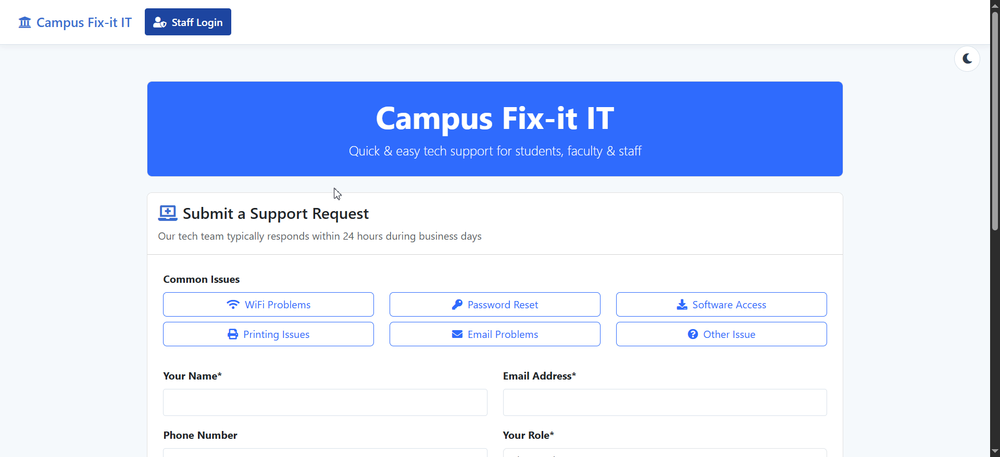

# Campus Fix-It IT: Support Ticketing System

A comprehensive Django-based ticketing system specifically designed for campus IT departments. Streamline support requests from students, faculty, and staff with an intuitive interface that prioritizes critical issues and provides powerful management tools for IT personnel.

## Demo Video

[](https://youtu.be/pZKruNWhr5M)

*Click the thumbnail above to watch the demo on YouTube*

## Key Features

### For IT Staff
- **Priority-Based Dashboard**: Top 10 open tickets automatically sorted by priority (Critical → High → Medium → Low) and creation date
- **Comprehensive Search**: Find tickets by title, description, assignee, user name, location, and more
- **Detailed Analytics**: Interactive charts showing ticket distribution by status, priority, time, and multi-dimensional heatmaps
- **Ticket Management**: Assign, update status, add resolution notes, and track complete history of each ticket
- **Full Audit Trail**: Every action is logged with timestamp and user details for complete accountability
- **Dark/Light Mode**: Customizable interface for day and night use
- **CSV Export**: One-click export of ticket data for reporting and analysis

### For Campus Users
- **Easy Ticket Submission**: Simple form with pre-populated issue templates for common problems
- **Real-Time Feedback**: Clear confirmation and ticket tracking information
- **Mobile-Friendly Interface**: Submit and check tickets from any device
- **No Login Required**: Students and faculty can submit tickets without creating accounts

### Campus-Specific Features
- **Location Awareness**: Track issues by campus building and location for faster response
- **Role-Based Context**: Identify if tickets are from students, faculty, staff, or other campus roles
- **Equipment Categories**: Specialized templates for classroom technology, lab workstations, WiFi issues, etc.

## Technical Highlights
- **Django Framework**: Robust backend with comprehensive data models
- **Bootstrap 5**: Responsive, modern interface that works on all devices
- **Chart.js**: Interactive, real-time data visualizations
- **Priority Intelligence**: Smart ticket sorting algorithm ensures critical issues are addressed first
- **Customizable**: Easy to adapt to specific campus needs and configurations

## Installation

### Prerequisites
- Python 3.8+
- Django 4.2+
- PostgreSQL or SQLite

### Quick Setup
1. Clone the repository
   ```bash
   git clone https://github.com/yourusername/campus-fixit-it.git
   cd campus-fixit-it
   ```

2. Set up virtual environment
   ```bash
   python -m venv venv
   
   # Windows
   venv\Scripts\activate
   
   # Mac/Linux
   source venv/bin/activate
   ```

3. Install dependencies
   ```bash
   pip install -r requirements.txt
   ```

4. Run migrations
   ```bash
   python manage.py migrate
   ```

5. Create a superuser
   ```bash
   python manage.py createsuperuser
   ```

6. Load sample data (optional)
   ```bash
   python manage.py load_mock_data
   ```

7. Start the development server
   ```bash
   python manage.py runserver
   ```

Visit http://127.0.0.1:8000/ in your browser to access the application.

## Use Cases
- **College IT Departments**: Track and manage support requests across campus
- **University Computer Labs**: Manage hardware and software issues
- **Campus Technology Centers**: Coordinate support for classroom technology
- **Student Help Desks**: Streamline support for student technology needs

## Screenshots




## Contact
For questions, customizations, or support, please contact:
- Email: jbrayden35@gmail.com
- LinkedIn: [Brayden Smith](https://www.linkedin.com/in/braydenjsmith22/)
